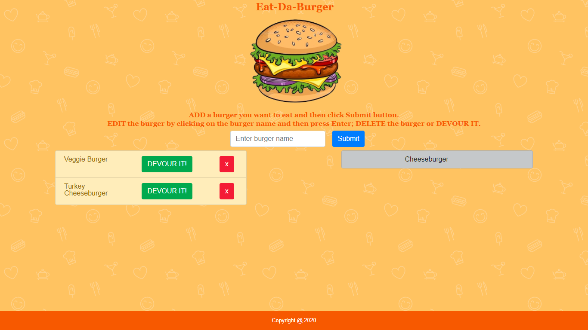

# burger

### File

* [`Eat-Da-Burger`](burger/blob/master/server.js)

### Technologies
MySQL, Node, Express, Handlebars and a user defined ORM. It follows a MVC design pattern; Node and MySQL to query and route data in the app, and Handlebars to generate the HTML.

MySQL CLI output

### Description
Eat-Da-Burger! is a restaurant app that lets users input the names of burgers they'd like to eat.

* Link: 
     * Site Link: https://hidden-beyond-72567.herokuapp.com/
     * Github Link: https://github.com/shruti-gaonkar/burger

      

* Eat-Da-Burger! is a restaurant app that lets users input the names of burgers they'd like to eat.

* Whenever a user submits a burger's name, the app will display the burger on the left side of the page -- waiting to be devoured.

* Each burger in the waiting area also has a `Devour it!` button. When the user clicks it, the burger will move to the right side of the page.

* The app will store every burger in a database, whether devoured or not.

* The burger names can be changed by clicking on the name, editing the text and then hitting Enter.

* The app also has a `DELETE` button to delete the burger.

